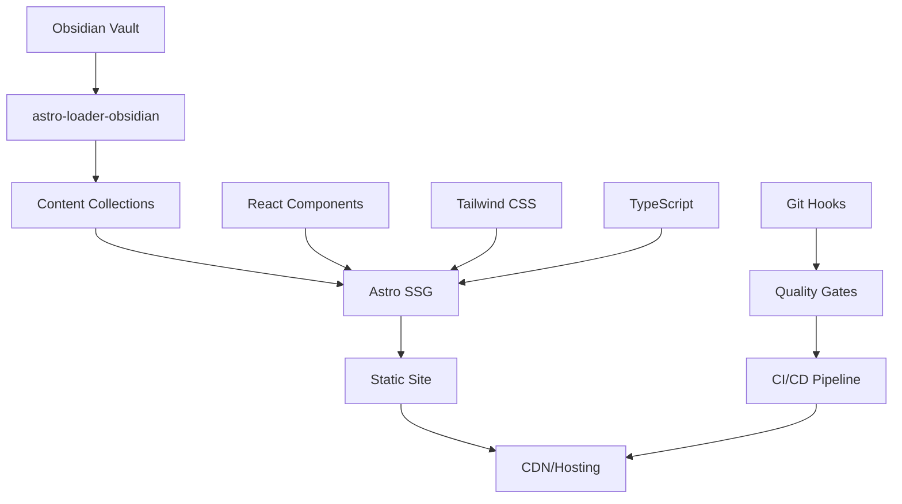
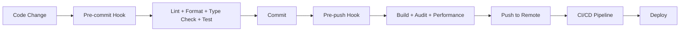

# Architecture Documentation

## System Overview

mitm.life is a modern, performance-focused cybersecurity blog built using a content-first architecture with seamless content management integration.

## Core Architecture



## Technology Stack

### Core Framework

- **Astro 5.x**: Static site generator with partial hydration
- **TypeScript**: Strict type safety throughout the codebase
- **Node.js 18+**: Runtime environment and build tooling

### Content Management

- **Obsidian**: Primary content authoring environment
- **astro-loader-obsidian**: Real-time sync between Obsidian and Astro
- **Content Collections**: Type-safe content API with schema validation

### UI & Styling

- **React 18**: Component library for interactive elements
- **Tailwind CSS**: Utility-first CSS framework
- **Radix UI**: Accessible component primitives
- **Lucide React**: Consistent icon system

### Development Tooling

- **ESLint**: Code quality and consistency
- **Prettier**: Automatic code formatting
- **Vitest**: Unit and integration testing
- **Playwright**: End-to-end testing

### Performance & Monitoring

- **Lighthouse CI**: Performance monitoring and budgets
- **Bundle Analysis**: Size monitoring and optimization
- **Sharp**: Image optimization and processing

## Directory Structure

```
mitm/
├── .husky/                    # Git hooks for quality assurance
│   ├── pre-commit            # Lint, format, type-check, test
│   ├── pre-push              # Build, audit, performance
│   ├── commit-msg            # Conventional commit validation
│   └── post-merge            # Dependency and cache management
│
├── obsidian-vault/           # Primary content authoring
│   ├── tools/               # Security tools and scripts
│   ├── guides/              # Step-by-step tutorials
│   ├── research/            # Original research content
│   └── resources/           # Curated reference materials
│
├── scripts/                  # Automation and maintenance
│   ├── health-check.js      # Comprehensive system diagnostics
│   ├── update-dependencies.js # Safe dependency management
│   ├── content-validation.js # Content quality assurance
│   └── bundle-analyze.js    # Bundle size analysis
│
├── src/
│   ├── components/          # React components
│   │   ├── ui/             # Base UI components (Button, Card, etc.)
│   │   ├── Header.tsx      # Site navigation
│   │   ├── BlogCard.tsx    # Content preview cards
│   │   └── ...
│   │
│   ├── pages/              # Astro routing and page components
│   │   ├── index.astro     # Homepage
│   │   ├── tools/          # Tools category pages
│   │   ├── guides/         # Guides category pages
│   │   ├── research/       # Research category pages
│   │   └── resources/      # Resources category pages
│   │
│   ├── utils/              # Utility functions
│   │   ├── contentUtils.ts # Content processing helpers
│   │   └── ...
│   │
│   ├── types/              # TypeScript definitions
│   │   └── index.ts        # Shared type definitions
│   │
│   ├── styles/             # Global styles and CSS
│   │   ├── globals.css     # Base styles and Tailwind imports
│   │   └── ...
│   │
│   └── test/               # Test setup and utilities
│       ├── setup.ts        # Test environment configuration
│       └── ...
│
├── public/                   # Static assets
├── dist/                     # Build output (generated)
└── ...config files
```

## Content Management System

### Content Flow

1. **Authoring**: Content created in Obsidian with real-time preview
2. **Sync**: `astro-loader-obsidian` automatically syncs changes
3. **Validation**: Content schema enforced via Astro Content Collections
4. **Processing**: Markdown processed with MDX support
5. **Rendering**: Static pages generated with optimal performance

### Content Schema

```typescript
// Enforced via src/content/config.ts
interface BlogPost {
  title: string; // Required: SEO and display title
  description: string; // Required: Meta description
  pubDate: Date; // Required: Publication date
  category: ContentCategory; // Required: Content categorization
  tags: string[]; // Required: Content tags
}

type ContentCategory = 'tools' | 'guides' | 'research' | 'resources';
```

### Link Resolution

- **Wiki-style links**: `[[Page Title]]` automatically resolved
- **Embeds**: `![[image.png]]` processed and optimized
- **Cross-references**: Automatic bidirectional linking
- **Asset handling**: Images and files properly referenced

## Component Architecture

### Component Hierarchy

```
App (Astro Layout)
├── Header (React)
│   ├── Navigation
│   └── Mobile Menu (Sheet)
├── Main Content (Astro)
│   ├── HeroSection (React)
│   ├── CategoryGrid (React)
│   ├── RecentPosts (React)
│   └── BlogCard[] (React)
└── Footer (Astro)
```

### Design System

- **Consistent spacing**: Tailwind spacing scale (4px base)
- **Typography**: Systematic heading hierarchy and text sizes
- **Color scheme**: Dark-first cybersecurity theme
- **Responsive design**: Mobile-first with breakpoint consistency

### State Management

- **Local state**: React hooks for component state
- **Global state**: Astro props and static data
- **No complex state management**: Leveraging static site generation

## Performance Architecture

### Optimization Strategies

1. **Static Site Generation**: Pre-rendered pages for optimal loading
2. **Partial Hydration**: Only interactive components use JavaScript
3. **Image Optimization**: Sharp-based processing and responsive images
4. **Code Splitting**: Automatic chunking and lazy loading
5. **Bundle Optimization**: Tree shaking and dead code elimination

### Performance Budgets

- **First Contentful Paint**: < 2.0 seconds
- **Largest Contentful Paint**: < 2.5 seconds
- **Cumulative Layout Shift**: < 0.1
- **Total Bundle Size**: Monitored with alerts for >10% increases

### Caching Strategy

- **Static Assets**: Long-term caching with versioning
- **HTML Pages**: Cache with appropriate headers
- **API Responses**: Cached where applicable
- **Build Cache**: Incremental builds for faster development

## Quality Assurance Architecture

### Automated Quality Gates



### Testing Strategy

- **Unit Tests**: Vitest for functions and components
- **Integration Tests**: Component interaction testing
- **E2E Tests**: Playwright for user workflows
- **Performance Tests**: Lighthouse CI for regression detection
- **Security Tests**: Automated vulnerability scanning

### Code Quality Tools

- **ESLint**: Comprehensive rules including security and accessibility
- **Prettier**: Consistent code formatting with Astro support
- **TypeScript**: Strict configuration with comprehensive type checking
- **Husky**: Git hooks for quality enforcement

## Security Architecture

### Security Layers

1. **Input Validation**: All user inputs validated and sanitized
2. **Content Security**: No inline scripts, strict CSP headers
3. **Dependency Security**: Regular audits and automatic updates
4. **Build Security**: No secrets in build process or output
5. **Runtime Security**: HTTPS-only, secure headers

### Content Security Policy

```javascript
// Implemented in production
{
  "default-src": "'self'",
  "script-src": "'self' 'unsafe-inline'", // Only for Astro hydration
  "style-src": "'self' 'unsafe-inline'",  // Tailwind requires inline
  "img-src": "'self' data: https:",
  "font-src": "'self'",
  "connect-src": "'self'"
}
```

## Deployment Architecture

### Build Process

1. **Content Sync**: Obsidian vault synchronized
2. **Type Checking**: Full TypeScript compilation
3. **Testing**: Complete test suite execution
4. **Linting**: Code quality validation
5. **Building**: Static site generation
6. **Optimization**: Asset optimization and compression
7. **Validation**: Final quality checks

### Hosting Strategy

- **Static Hosting**: JAMstack deployment model
- **CDN**: Global content distribution
- **HTTPS**: SSL/TLS encryption enforced
- **Performance Monitoring**: Real-time metrics and alerting

## Monitoring & Observability

### Performance Monitoring

- **Core Web Vitals**: Automated monitoring and alerting
- **Lighthouse CI**: Continuous performance regression testing
- **Bundle Analysis**: Size tracking and optimization alerts
- **Error Tracking**: Client-side error monitoring

### Content Monitoring

- **Link Validation**: Automated broken link detection
- **Content Quality**: Automated content validation
- **SEO Monitoring**: Meta tag and structure validation
- **Accessibility**: Automated accessibility testing

## Scalability Considerations

### Content Scale

- **Static Generation**: Scales to thousands of pages efficiently
- **Incremental Builds**: Only changed content reprocessed
- **Content Caching**: Efficient content delivery at scale
- **Search Optimization**: Client-side search for large content volumes

### Development Scale

- **Modular Architecture**: Components can be developed independently
- **Type Safety**: TypeScript prevents runtime errors at scale
- **Automated Testing**: Comprehensive test coverage maintains quality
- **Documentation**: Self-documenting code and architecture

## Future Architecture Considerations

### Planned Enhancements

1. **Advanced Search**: Full-text search with indexing
2. **Interactive Features**: Comment system and user interactions
3. **Analytics**: Privacy-focused analytics implementation
4. **Internationalization**: Multi-language support architecture
5. **API Layer**: Headless CMS capabilities for external integrations

### Migration Strategies

- **Database Integration**: Seamless transition from static to dynamic content
- **API Development**: RESTful API layer for extended functionality
- **User Management**: Authentication and authorization system
- **Real-time Features**: WebSocket integration for live updates

---

This architecture provides a solid foundation for a high-performance, maintainable, and scalable cybersecurity blog while maintaining excellent developer experience and content management capabilities.
